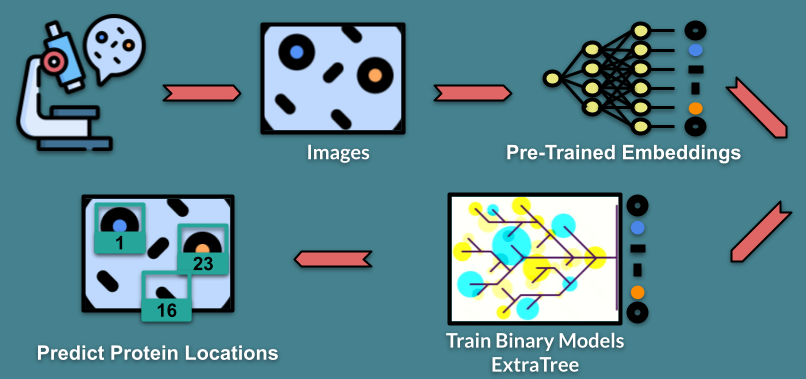
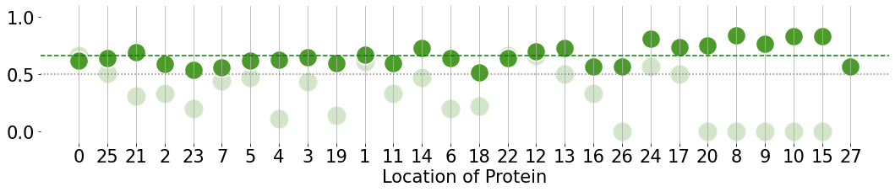

# Capstone Project: Human Protein Atlas Image Classification
## Protein Hunters: Harnessing the power of AI to automate image analysis

In this project we are building machine learning classification models for automated image analysis. We aim to identify the subcellular locations of proteins inside cultured human cells.  <br>
A protein's location is connected to its activity within the cell. The location can therefore be a target for pharmaceutical research e.g. while finding a vaccine. Our advanced methods could help researchers to speed up the image analysis process and allow for high throughput imaging.<br>
The data and the idea for the project are from [this](https://www.kaggle.com/competitions/human-protein-atlas-image-classification/overview) kaggle challenge. The dataset consists of images of cultured human cells. The cells were stained with antibodies and imaged on a fluorescence microscope. The dataset holds 31072 different image stacks. Each stack contains four pictures: from the blue, green, yellow and red channnel of the microscope. The blue, yellow and red channel each contain one spatial marker, that serves as an identifier for one subcellular structure/location. The green channel contains the spatial informaton of the protein of interest, who's location needs to be determined.<br>
For one image stack, the protein of interest can be located in more than one location, which makes this task a multi-label classification problem. 

## How we approached the challenge
The kaggle challenge requires the use of the macro f1 score as a metric. The winning model has a macro f1 score of 0.59369. Considering many good solutions already exist, we decided to focus on finding a model solution that required a minimal amount of computing power, i.e. it could be run on your laptop. To do this we combined a pre-trained model (EfficientNetB0, a Convolutional Neural Network, CNN) with a series of binary classification models tuned to each location. This process is described in the following image: 
<br>
<br>

<br>

The second reason for using binary models is that the data at hand are highly imbalanced. We hypothesized that training a binary model for each location would help to overcome this imbalance. The resulting 28 binary models are comparably good at handling imbalanced data as each of them is trained for a single location to predict if the protein of interest is present in this location or not.<br>
## Requirements:

- pyenv with Python: 3.9.4

### Setup
To run our notebooks and scripts, use the following setup: 
```
pyenv local 3.9.8
python -m venv .venv
source .venv/bin/activate
pip install --upgrade pip
pip install -r requirements.txt
```

## Stakeholder
Our Stakeholder is a company that builds microscopes, and our machine learning model will help to improve their smart-microscopes. 
## Value 
Proteins are important for all kind of processes in a cell. For example to create something like a vaccine the researcher needs to know how to get a protein onto the right location in a cell, so it can protect us. <br>
At the moment, modern microscopes can quickly produce cell images, but experts are still needed to visually inspect the images to determine protein locations. These experts require a lot of training and time to go through the images. This costs a lot of money and in the case of pharmaceutical research, it can also affect the health of humans and animals. <br>
Models that can make the work of these experts easier and faster is therefore highly sought after. 
## Baseline model
Three of our team members studied biology, and could identify the locations of proteins. So we decided to use their results as our baseline model. This model therefore represents the current, traditional method of determining protein locations. The three biologists were able to go through 164 images in 4 hours, and achieved a macro f1 score of 0.32. This is the model we want to improve. 
## Documentation of our analysis and model traing
In the notebooks in this repository we documented our work. They are arranged in the following order:
 - [1. Exploratory Data Analysis: getting to know our dataset](https://github.com/reneebrecht/human-protein-atlas-image-classification/blob/main/notebooks/1_EDA_on_images.ipynb)

 - [2. Data processing: combining the image colors into one array and passing this through the pre-trained CNN](https://github.com/reneebrecht/human-protein-atlas-image-classification/blob/main/notebooks/2_File_Conversion_Embeddings.ipynb)

 - [3. Model setup: determining the best model, optimizing its parameters, and training it for each protein location](https://github.com/reneebrecht/human-protein-atlas-image-classification/blob/main/notebooks/3_Binary_models_CrossVal_and_GridSearch.ipynb)

 - [4. Plotting the f1 scores: comparing the model and the baseline model for every location](https://github.com/reneebrecht/human-protein-atlas-image-classification/blob/main/notebooks/4_Plotting_final_f1_scores.ipynb)

 - [5. Simulating real-world prediction: given a set of images, the final trained model configuration (i.e. 28 binary models) is used to predict protein locations](https://github.com/reneebrecht/human-protein-atlas-image-classification/blob/main/notebooks/5_Dry_Run_Predict_with_binary_models.ipynb)

If you want to run the notebooks you have to save the data from the [challenge](https://www.kaggle.com/competitions/human-protein-atlas-image-classification/overview) in the folder `train` under [data](https://github.com/reneebrecht/human-protein-atlas-image-classification/tree/main/data). You also need the empty folders `embeddings_train` and `images_train_tfrec` in the data directory. 
## The results
The final model (Extra-trees Classifier) trained for each location are found in the folder [models](https://github.com/reneebrecht/human-protein-atlas-image-classification/tree/main/models).
We achieved a macro f1-score of 0.67, and as shown in this plot of f1 scores, our model (dark green dots) equalled or exceeded the baseline model (light green) at all locations:

<br>



<br>